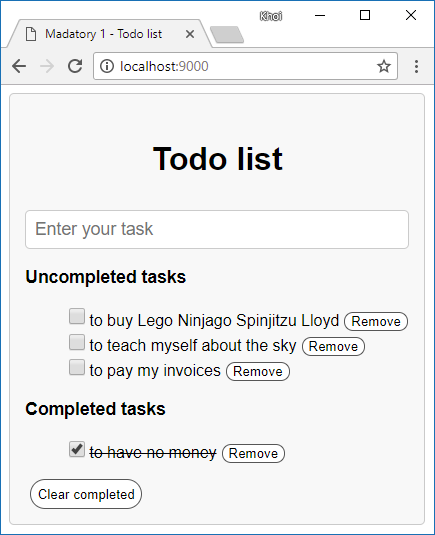

# Mandatory - Todo list
The simple web application created by using HTML, CSS, React ([View online demo](http://nguyenkhois.github.io/mandatory-todo-list/dist)).

## Screenshot

## Compatibility
Build environment is compatible with:
* Windows
* MacOS
* Debian

Webpack Dev Server reload automatically your web browser whenever a change is made to one of your files.

## Installation
* Run `npm install` to install all needed packages

## Using
* Run `npm start` or `npm run start` to start your local web server at `localhost:9000`
* Run `npm run build` to build your *.js files to `dist` folder
* Run `npm run build:all` to build all your files (*.js and styles.css) with `--mode production` to `dist` folder

## References
* [Non-mutating methods](https://developer.mozilla.org/en-US/docs/Web/JavaScript/Reference/Global_Objects/Array/prototype#Accessor_methods)
* [Expressions and operators in JavaScript](https://developer.mozilla.org/en-US/docs/Web/JavaScript/Reference/Operators)